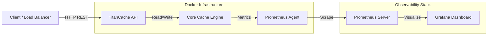

# TitanCache


**TitanCache** is a high-throughput, thread-safe, in-memory key-value store designed for low-latency applications. Built with **Java 21** and **Spring Boot**, it implements a custom **LRU** eviction policy using a HashMaps with Doubly Linked Lists to achieve an `O(1)` time complexity for both lookups and updates.

This project was designed to handle high-concurrency scenarios and TitanCache leverages locking mechanisms (`ReentrantReadWriteLock`) to maximize read throughput while ensuring data integrity.

---

## Key Features

- **High Performance:** Custom data structure implementation ensures **O(1)** operations for `get`, `put`, and eviction.
- **Concurrency Ready:** Validated support for **3,000+ concurrent users** with minimal lock contention.
- **Memory Safety:** Configurable capacity and entry size limits to prevent OOM errors.
- **Observability:** Built-in integration with **Prometheus** and **Grafana** for real-time metrics (Hits, Misses, Evictions, Memory Usage).
- **Containerized:** Fully Dockerized environment for easy deployment and scaling.
- **Robust Testing:** Includes a Python-based `asyncio` benchmarking suite to simulate "Nuclear" load scenarios.

---

## Architecture

### Core Engine
The heart of TitanCache is the `TitanCache` class, which orchestrates data storage and eviction.
- **Storage:** A `HashMap<K, CacheNode<K, V>>` provides direct access to cache nodes.
- **Eviction Policy:** A custom Doubly Linked List maintains the order of usage.
    - **Access:** Moving a node to the head is O(1).
    - **Eviction:** Removing the tail node is O(1).
- **Thread Safety:** A `ReentrantReadWriteLock` is used to allow multiple simultaneous readers while ensuring exclusive access for writers. `AtomicInteger` counters are used for lock-free metric tracking.

### System Design


---

## Tech Stack

- **Language:** Java 21
- **Framework:** Spring Boot 3.x
- **Build Tool:** Maven
- **Containerization:** Docker & Docker Compose
- **Monitoring:** Prometheus, Grafana, Micrometer
- **Testing:** JUnit

---

## APIs

Base URL: `http://localhost:8080/api/cache`

| Method | Endpoint | Description | Payload |
| :--- | :--- | :--- | :--- |
| `POST` | `/store` | Store a key-value pair | `{ "key": "user:123", "value": "data" }` |
| `GET` | `/retrieve/{key}` | Retrieve a value | N/A |
| `GET` | `/metrics` | Get cache statistics | N/A |
| `DELETE` | `/clear` | Clear all data | N/A |
| `GET` | `/status` | Health check | N/A |

---

## Configuration

Configure the cache behavior in `src/main/resources/application.properties` or via environment variables.

| Property | Default | Description |
| :--- | :--- | :--- |
| `titan.cache.capacity` | `10000` | Maximum number of items in the cache. |
| `titan.cache.max-entry-size-bytes` | `128000` | Max size (in bytes) for a single value. |

---

## Getting Started

### Prerequisites
- Docker & Docker Compose
- Java 21 (for local development)
- Maven

### Running with Docker (Recommended)
The easiest way to run the full stack (App + Prometheus + Grafana):

```bash
docker-compose up --build
```

- **API:** `http://localhost:8080`
- **Grafana:** `http://localhost:3000` (Login: `admin` / `admin`)
- **Prometheus:** `http://localhost:9090`

---

## Benchmarking

TitanCache includes a "Nuclear" benchmark script (`benchmark.py`) built with Python `asyncio` to simulate high-load scenarios.

### Stress Test Demo
Watch the system handle 3,000 concurrent users and 5,000+ Req/Sec:

[](https://www.youtube.com/watch?v=20R16ATSCAw)

### Scenarios
1.  **Realistic E-Commerce:** 90% Reads / 10% Writes (Zipfian distribution).
2.  **Flash Sale Spike:** High concurrency (3000 users), Hot keys.
3.  **The Ram Eater:** Large payloads to test memory pressure.

### Run the Benchmark
Ensure the server is running, then:
```bash
# Install dependencies
pip install -r requirements.txt

# Run the script
python benchmark.py
```

### Results
The script exports raw performance data to [`titan_nuclear_benchmark.csv`](titan_nuclear_benchmark.csv), including timestamps, latency (ms), and payload sizes for every request. You can use this CSV for further data analysis or visualization.

View the full dataset on **Kaggle**: [Distributed Cache Performance Logs (Synthetic)](https://www.kaggle.com/datasets/imrahnf/distributed-cache-performance-logs-synthetic)

---

Built with ❤️ by [Omrahn Faqiri](https://omrahnfaqiri.com)
